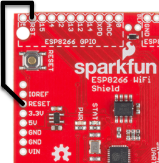

# NXP IMXRT1050-EVKB

## Overview

The i.MX RT1050 EVK is a 4-layer through-hole USB-powered PCB. At its heart lies the i.MX RT1050 crossover MCU, featuring NXP's advanced implementation of the Arm Cortex-M7 core. This core operates at speeds up to 600 MHz to provide high CPU performance and great real-time response.

## Schematics

- [IMXRT1050-EVKB board schematic](./SPF-30168_B1.pdf)

## CMSIS-Drivers

This board support pack contains a CMSIS-Driver for the [VIO](https://arm-software.github.io/CMSIS_5/develop/Driver/html/group__vio__interface__gr.html) interface. This is a virtual I/O abstraction for peripherals that are typically used in example projects. The **Blinky** example uses this interface to create a blinking light with the USER LED mounted on the board that can be controlled by the USER BUTTON (SW8).

| Virtual Resource  | Variable       | Physical Resource on IMXRT1050-EVKB |
|-------------------|----------------|-------------------------------------|
| vioBUTTON0        | vioSignalIn.0  | WAKEUP SW8(USER_BUTTON)             |
| vioLED0           | vioSignalOut.0 | GPIO_AD_B0_09 (USER_LED)            |
| vioMotionAccelero | vioValueXYZ[1] | 3-Axis Accelerometer (FXOS8700CQ)   |
| vioMotionMagneto  | vioValueXYZ[2] | 3-Axis Magnetometer (FXOS8700CQ)    |

Refer to the [schematics](#schematics) for board connection information.

## WiFi Shields

For the correct operation of WiFi shields using the Arduino R3 header, make sure that the following jumpers are correctly fitted:
- J26 closed
- J27: 1-2 closed

### Special considerations

For correct operation, the SparkFun ESP8266 WiFi Shield requires a jumper cable to connect the **RESET** pin on the Arduino connector with the **RST** pin in the area marked as **ESP8266 GPIO**:

## CMSIS-DAP Firmware

Make sure that you have updated your CMSIS-DAP firmware to the latest version. This makes the board compatible with [Keil Studio Cloud](https://keil.arm.com) that enables browser-based project creation and debugging. The following instructions apply if your board is equipped with at U23 a Kinetis K20DX device (marked as M20AGV).

### Using HyperFlash

If your board is configured for HyperFlash (SW7 is set to OFF/ON/ON/OFF), use the following CMSIS-DAP firmware: [DAPLink 0254](../DAPLink/0254_k20dx_mimxrt1050_evk_hyper_0x8000.bin)

### Using QSPI Flash

If your board is configured for QSPI Flash (SW7 is *not set* to OFF/ON/ON/OFF), use the following CMSIS-DAP firmware: [DAPLink 0254](../DAPLink/0254_k20dx_mimxrt1050_evk_qspi_0x8000.bin)

**Flashing instructions for Windows users**

1. While holding down the boards reset button, connect the boards USB debug port to the computer. It should enumerate and mount as **MAINTENANCE**.
1. Drag-and-drop the firmware file onto the mounted drive.
1. Wait for the file copy operation to complete.
1. Power cycle the board. It will now enumerate and mount as DAPLINK or the name of the board.

**Flashing instructions for Linux users**

1. While holding down the boards reset button, connect the boards USB debug port to the computer. It should enumerate as MAINTENANCE.
1. In a terminal execute  
   `cp <path to firmware file> <MAINTENANCE> && sync`  
   *Note*: make sure to change MAINTENANCE to the name of the mount point of the drive on your system.
1. Power cycle the board. It will now enumerate and mount as DAPLINK or the name of the board.

**Flashing instructions for MAC users**

1. While holding down the boards reset button, connect the boards USB debug port to the computer. It should enumerate as MAINTENANCE.
1. In a terminal execute  
   `sudo mount -u -w -o sync /Volumes/MAINTENANCE ; cp -X <path to firmware file> /Volumes/MAINTENANCE/`  
   *Note*: If your drive does not mount as MAINTENANCE make sure to change this to match the name of the mounted disk attached to your system.
1. Wait for the file copy operation to complete.
1. Power cycle the board. It will now enumerate and mount as DAPLINK or the name of the board.
